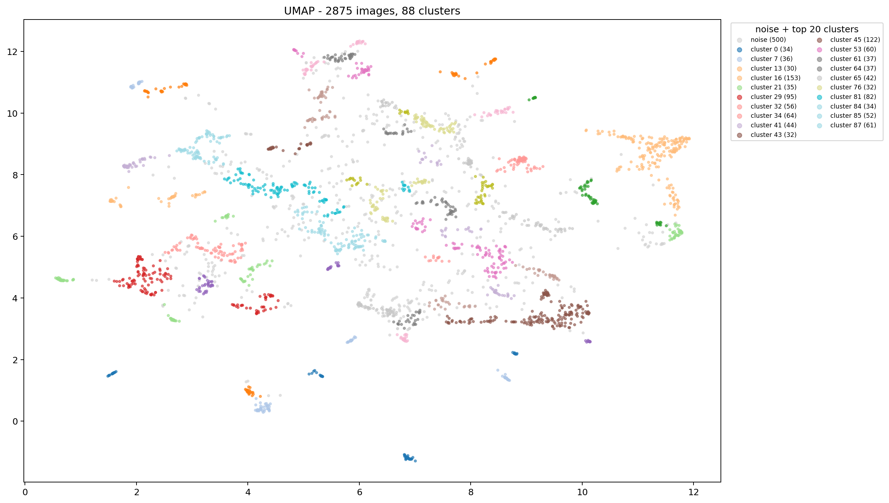
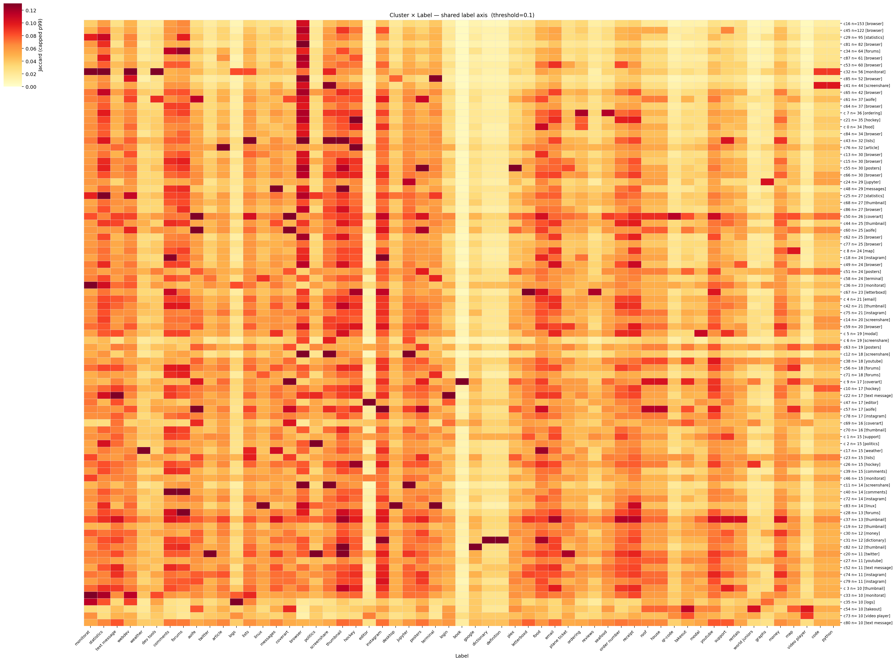
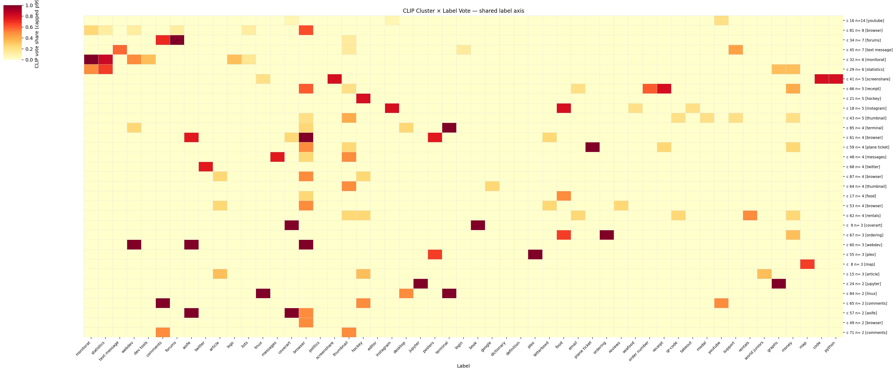

# **brūki** · Image Charts & Tagging

Exploring image activity over time from multiple sources & image types, and building out a screenshot labeling/tagging system.

## Setup

```bash
git clone https://github.com/brege/bruki
cd bruki && uv sync # [--extra notebook --extra ml]
cp config.example.yaml config.yaml
# see "Configuration" below -> edit config.yaml
uv run activity # --output-dir images
```

This sequence will generate heatmaps, histograms, and trends about source image data based on what's configured in your `config.yaml`.

## Features

### Part 1: Time Series Analysis

- Generate heatmaps and histograms of image saving activity over hours, days, and months
- Use file timestamps, modified-times, EXIF, and regex parsing for refined image discovery
- Add bands and markers for major life events and device purchases

If you don't care about the screenshot analysis ([Part 2](#part-2) below) and just want to generate activity plots, you can go directly to [Background](#background).

### Part 2: Screenshot Categorization

> [!WARNING]
> This section is under active development.

- Use baseline Data Science exploration techniques to categorize ~3000 screenshots
- Compare OCR via [tesseract](https://github.com/UB-Mannheim/tesseract) and CLIP from [OpenAI](https://github.com/openai/CLIP)
- Building out a tagging/labeling web app and API to interactively annotate screenshots with machine learning assistence

Ensure, if you plan on doing ML work:
```bash
uv sync --extra ml --extra notebook
```

This effort is evolving this project into a web app that can automatically and interactively categorize screenshots. There are three main parts of the web app:

1. Generate a reproducible screenshot sample for manual labels.
   ```bash
   uv run python -m bruki.samples --seed 42 --samples 200
   ```

2. Launch the labeling app and label the sample.
   ```bash
   uv run www
   ```
   Open http://localhost:5000. This relies on your configuration in `config.yaml`.

3. The notebook analysis compares your manual labels with OCR and CLIP clustering.
   ```bash
   jupyter notebook classify.ipynb
   ```

The web app stores labels in `data/server/labels.jsonl`, and notebook experiments can be rerun as this file grows.

## Background

See [my blog post](https://brege.org/post/image-activity/) for motivation behind the first half, Part 1, of this project.

### Questions

- do I tend to take more pictures during certain times of year?
- how has my screenshot usage evolved over the last 15 years?
- do I have "honeymoon" periods after a device purchase?
- in what ways has my camera and screenshot usage changed between being an academic, chef, and developer?

My reference image collection fits in three main categories:

1. **camera** photos from my phone
2. **screenshots** from both my laptop and my phone
3. **internet** pictures downloaded from the internet

### Screenshot vs. Camera vs. Internet Trends


### Image Capture Concurrency


### Heatmap: Desktop Screenshots, Phone Screenshots, and Camera

<table>
  <tr>
    <td></td>
    <td></td>
    <td></td>
  </tr>
</table>

### Hourly Histograms: Device Activity vs. All Sources

<table>
  <tr>
    <td></td>
    <td></td>
  </tr>
</table>

### Daily and Monthly Histograms: All Sources

<table>
  <tr>
    <td></td>
    <td></td>
  </tr>
</table>


## Part 2: Screenshot Categorization

Assumes running through the workflow of labeling ~5-10% of your screenshots with the `uv run www` tool.

All images are generated through the Jupyter notebook [classify.ipynb](classify.ipynb) using two different clustering methods:

1. Tesseract > extraction of OCR tokens > Jaccard similarity > cluster vs. label
2. CLIP > extraction of image embeddings > cosine similarity > heatmap cluster vs. label

### Labeled Screenshots UMAP Clusters using CLIP



###  Jaccard Similarity of Cluster OCR Vocabulary vs Manual Labels



### CLIP Cluster Vote vs Manual Labels



See [classify.ipynb](classify.ipynb) for full analysis. In short: CLIP is more accurate, faster, but OCR provides more fuzz for multi-labeling.

The web app currently includes only CLIP clustering in the backend. OCR will be useful to make search more robust and to provide additional suggestions.

## Configuration

1. **sources**: these are local paths to image directories

   ```yaml
   data:
     camera:
       label: camera
       color: "#c95de8"
       methods:
         - exif-created
         - timestamp
         - modified-time
       sources:
         phone:
           path: ~/Syncthing/Phone/DCIM/Camera
         laptop:
           path: ~/Pictures/Camera
   ```

2. **plotting**: specify figures for each analysis key (`--key`)

   ```yaml
   plots:
     camera:
       series:
         - camera
       title: Camera Activity
       value_label: Photos
       figures:
         - kind: heatmap_per_source
           series_key: source
       events:
         - phd_defense
   ```

3. **major events**: direct marker/band definitions

   ```yaml
   events:
     phd_defense:
       type: band
       after: 2017-02-01
       before: 2017-07-31
       label: PhD Defense
   ```

### Notes

> [!IMPORTANT]
> The YAML structure adds additional verbosity and line-of-code bloat that cannot be forgiven. It is indeed easier to just run a few small Python/matplotlib scripts to generate these plots. 

> [!NOTE] 
> This project, like [sanoma](https://github.com/brege/sanoma), is part of a series of datamine-yourself projects that are, at a later date, aiming to converge these tools into a series of collectors.

## License

[GPLv3](https://www.gnu.org/licenses/gpl-3.0.en.html)
