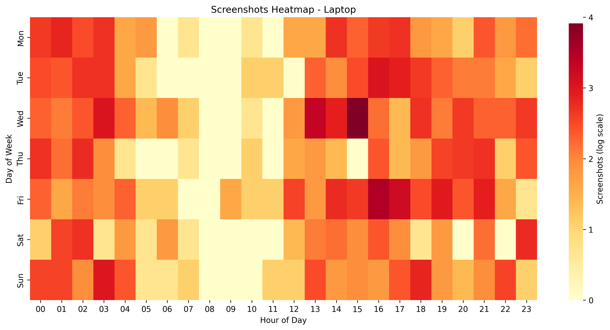
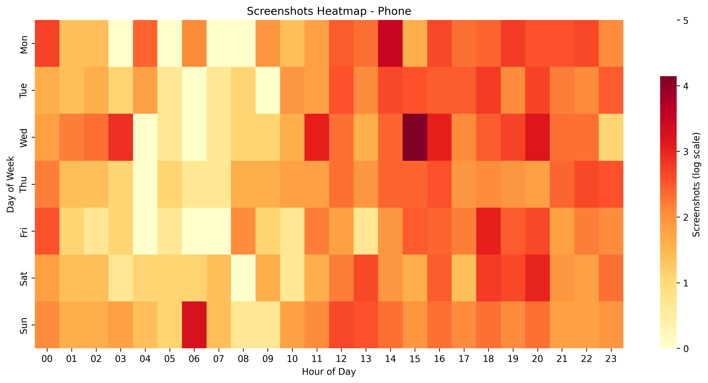
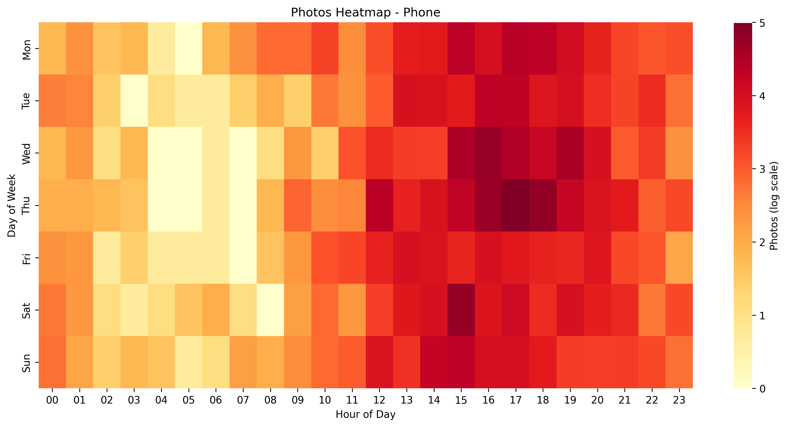

# Image Activity

Plotting image activity over time from multiple sources and image types.

## Quickstart

```bash
git clone https://github.com/brege/image-activity.git && cd image-activity
cp config.example.yaml config.yaml
# edit paths
uv run activity # -o images
```

## Features

- Add bands and markers for major life events
- Generate heatmaps over days of week and hours of day
- Timestamp, modified-time, EXIF, and regex parsing for refined picture-set slicing

## Gallery

### Camera Usage


### Screenshots, Phone Camera, and Download Concurrency


### Heatmaps
<table>
  <tr>
    <td></td>
    <td></td>
    <td></td>
  </tr>
</table>

### Histograms: By device and By type
<table>
  <tr>
    <td></td>
    <td></td>
  </tr>
</table>

## Usage

Specify a key via `-k|--key`:

```bash
uv run activity
uv run activity --key screenshots
uv run activity -k internet
uv run activity -k camera
```

Set a custom output directory via `-o|--output-dir`: 

```bash
uv run activity -o images
```

## License

GPLv3
