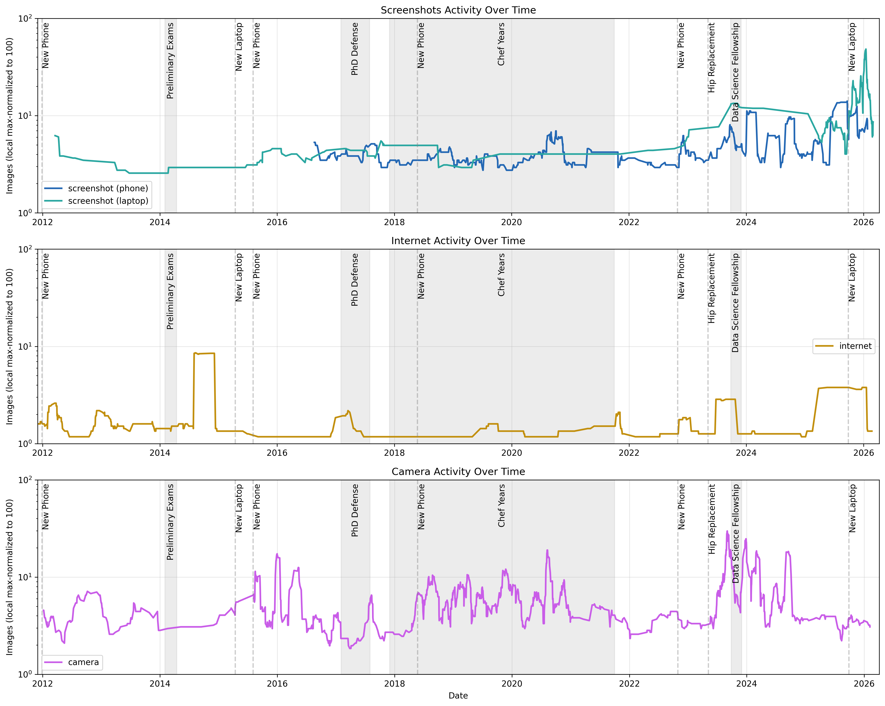
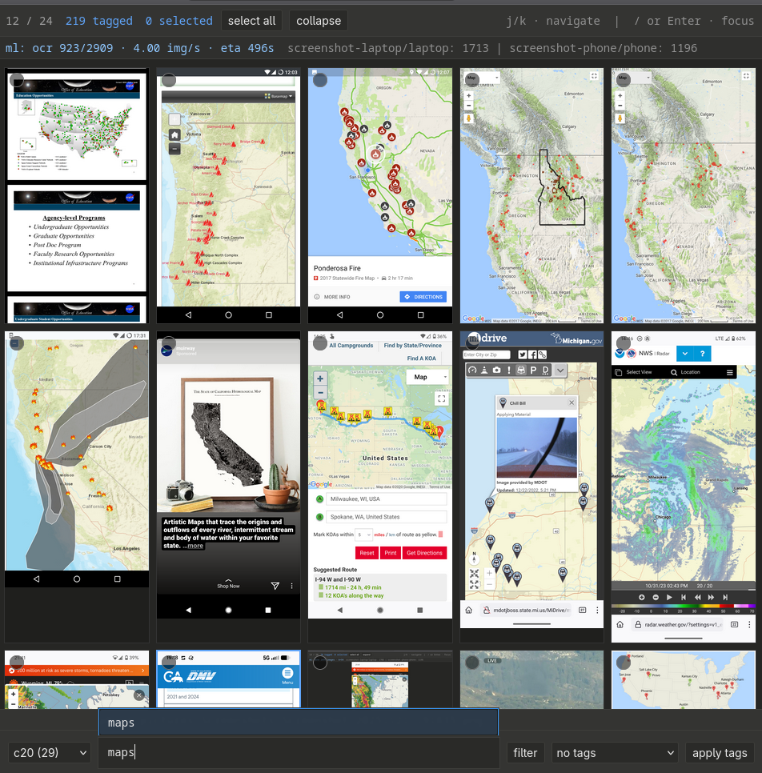
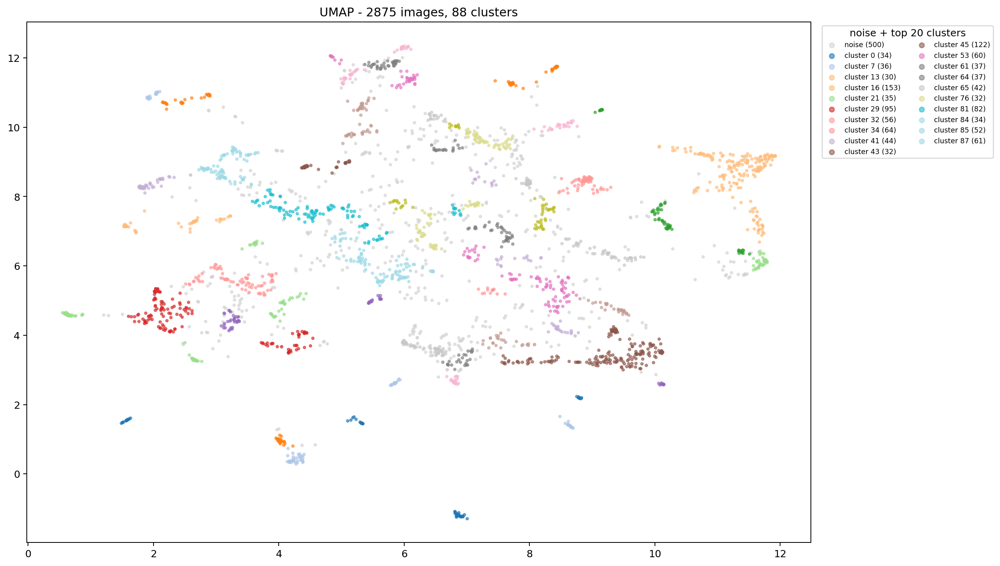
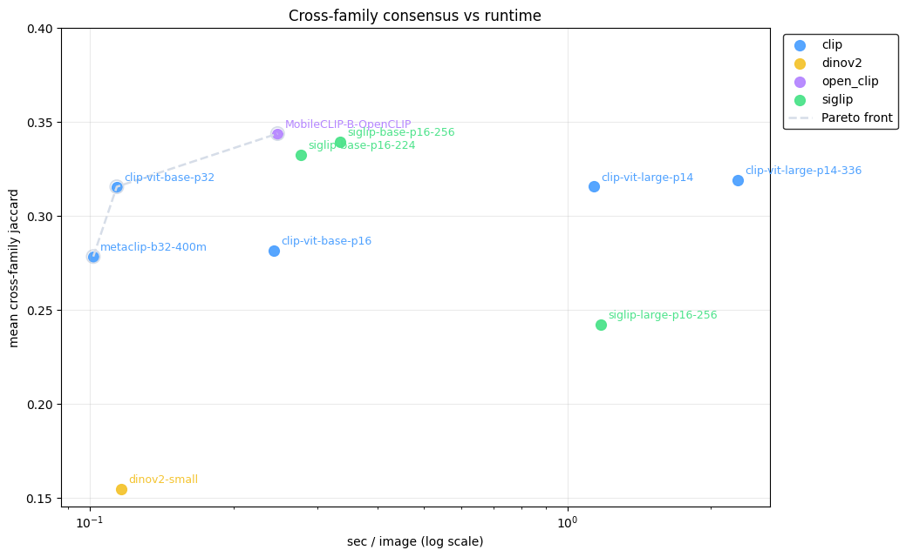

# **brūki**

Brūki analyzes your image collections and has a screenshot tagging system that works right from your web browser. 

Its [Screenshot Tagger](bruki/server/#readme) uses machine learning clustering that makes categorizing oft captured recipes, receipts, chats, etc classifiable. Since screenshot filenames provide very little metadata context, brūki's multi-model approach using [OpenAI](https://openai.com/)'s [CLIP](https://github.com/openai/CLIP) and [OCR](https://en.wikipedia.org/wiki/Optical_Character_Recognition) via [tesseract](https://github.com/UB-Mannheim/tesseract) helps you group by your screenshots similarity.

## Setup

```bash
git clone https://github.com/brege/bruki
cd bruki && uv sync # [--extra notebook --extra ml]
```


## Exploratory Data Analysis

Configure all image sources in `config.yaml`, demarcate major events, and generate the plots in [Exploratory Data Analysis](notebooks/#readme).

```bash
uv run activity
```

See my blog post [*Exploring my camera, screenshot, and image activity*](https://brege.org/post/image-activity/) for pictures and complete exploratory data analysis.

## Data Science & Machine Learning

OCR extraction, CLIP-family clustering, and supervised OCR vs. CLIP evaluation are documented in [Data Science & Machine Learning](notebooks/#readme).

```bash
uv sync --extra notebook --extra ml
jupyter notebook notebooks/
```

## Screenshot Tagger

Labels used in the [Classifier Notebook](notebooks/classify.ipynb) (Jupyter) are generated through brūki's web UI. See [Screenshot Tagging Server](bruki/server/#readme).

```bash
uv sync --extra ml
uv run www
```

## Gallery

<table>
  <tr>
    <td>
      
      <br><strong>Activity Explorer</strong>
    </td>
    <td>
      
      <br><strong>Screenshot Tagger</strong>
    </td>
  </tr>
  <tr>
    <td>
      
      <br><strong>Cluster Map</strong>
    </td>
    <td>
      
      <br><strong>CLIP Models - Pareto Curve</strong>
    </td>
  </tr>
</table>

## Contributing

Brūki is very much a work in progress!

- [Contributing](docs/contributing.md)
- [Roadmap](docs/roadmap.md)

## License

[GPLv3](https://www.gnu.org/licenses/gpl-3.0.en.html)
